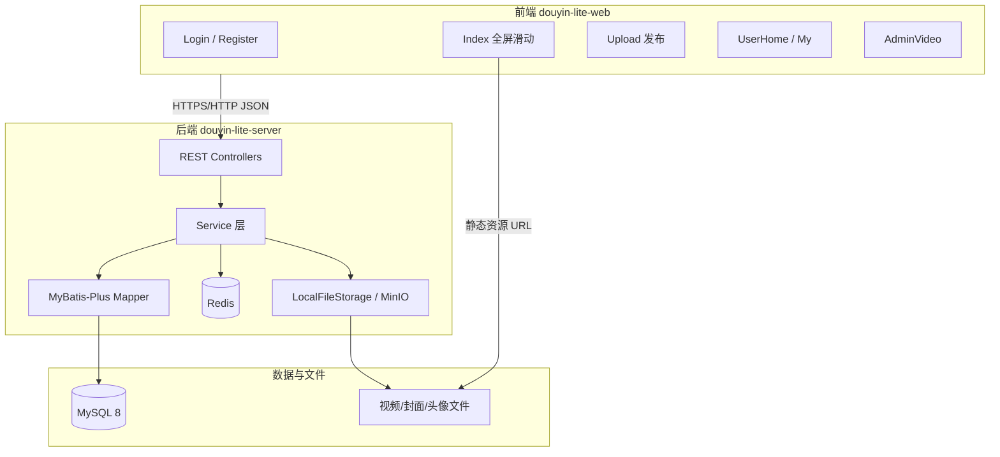
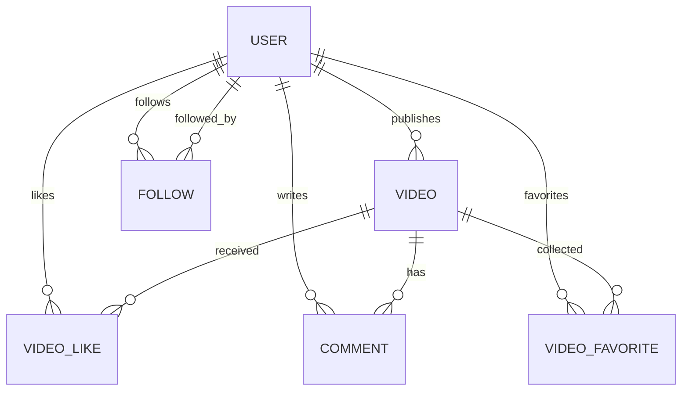
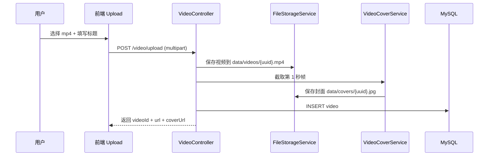
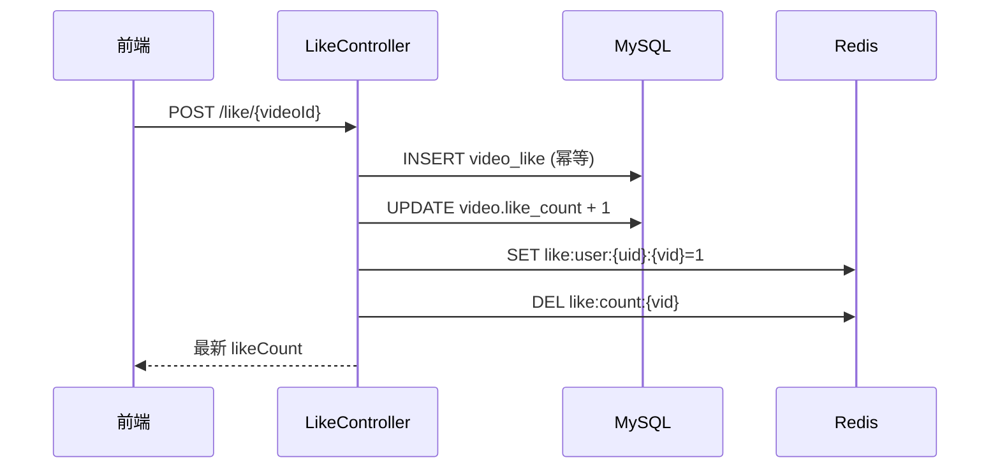

# 抖音极简版（Douyin-Lite）— 设计文档

> 项目代号：`douyin-lite`  
> 定位：前后端分离的短视频 Web 应用，仿抖音网页版核心体验  
> 日期：2026-06-10  
> 状态：设计评审稿

---

## 一、可行性结论

### 1.1 总体判断：**可行，但必须新建独立项目**

当前 `javaProjects` 目录是**财务/ OA 企业级单体仓库**，与短视频社交产品场景差异极大。结论如下：

| 维度 | 当前目录现状 | 对抖音项目的意义 |
|------|-------------|-----------------|
| 后端语言 | Java 8 + Spring Boot 2.x | **可借鉴分层与 ORM 习惯**，不建议直接依赖现有模块 |
| 数据层 | MyBatis-Plus 3.4 + Druid + MySQL | **高度契合**，可直接沿用技术选型 |
| 缓存 | Spring Data Redis | **高度契合**，用于点赞计数、会话辅助 |
| 前端 | 无 Vue 项目；仅有 JSP/jQuery 老页面 | **需全新搭建** Vue 3 前端 |
| 认证 | `finance-auth-client`、CAS、企业 JWT | **不可用**（强绑定爱奇艺内网体系） |
| 文件存储 | `iqiyi-oss-java-sdk` + MongoDB 元数据 | **不可用**；改用本地磁盘或 MinIO |
| 微服务 | Eureka、Feign、配置中心、MQ | **不需要**；单体 Spring Boot 即可 |
| 包名/仓库 | `com.qiyi.finance.*`、爱奇艺 Maven 私服 | **不沿用**；使用开源 Maven 中央仓库 |

**推荐策略：**

1. 在 `javaProjects/douyin-lite/` 下新建**完全独立**的前后端工程，与 `finance-service-*` **零 Maven 依赖**。
2. **借鉴**现有项目的工程习惯（分层、统一响应体、MyBatis-Plus 写法），**不复制**任何 `com.qiyi.*` / `com.iqiyi.*` 代码或依赖。
3. 技术栈与当前目录**对齐**：Java 8 + Spring Boot 2.7.6，降低环境切换成本，MyBatis-Plus / Druid / Redis 写法可直接参考现有项目。

### 1.2 与原始 7 天计划的差异说明

| 原始计划 | 本设计调整 | 原因 |
|---------|-----------|------|
| 5 张表 | **7 张表** | 原方案提到「收藏」但无对应表；补充 `video_favorite`、`user` 角色字段 |
| `vue3-video-play` 一行搞定 | **首选 Swiper 垂直滑动 + 原生 video** | 可控性更高、依赖更轻；`vue3-video-play` 作为备选 |
| 未说明存储 | **本地存储 + 可切换 MinIO** | 摆脱企业 OSS，本地开发零成本 |
| JDK 17 + SB 3 | **改为 Java 8 + SB 2.7.6** | 与当前仓库一致，本机无需额外装 JDK 17 |

---

## 二、项目范围

### 2.1 做什么（MVP）

- 用户注册、登录、退出、获取当前用户信息
- 全屏黑色主题首页：上下滑动切换视频、自动播放/暂停
- 视频上传、自动截取封面、视频流列表、单条详情
- 点赞 / 取消点赞（Redis 辅助计数）
- 评论发布与列表
- 关注 / 取消关注
- 收藏 / 取消收藏
- 个人主页（他人视角）、个人中心（自己视角）、我的发布
- 管理后台：视频列表、删除视频（需管理员角色）

### 2.2 不做什么（V1 排除）

- 推荐算法 / 个性化 Feed
- 直播、私信、弹幕
- 视频转码多清晰度（HLS/DASH）
- 移动端 App / 小程序
- 接入现有 `finance-service-*` 任何服务
- 爱奇艺内网组件：Eureka、Feign、config-client、iqiyi-oss、finance-auth、RocketMQ 定制版等

### 2.3 关键决策

| # | 决策项 | 结论 |
|---|--------|------|
| 1 | 项目形态 | 单体后端 + SPA 前端，前后端分离 |
| 2 | 部署单元 | 后端 Jar + Nginx 静态资源；视频文件本地或 MinIO |
| 3 | 认证方案 | Sa-Token + JWT 模式（Header 传 `Authorization: Bearer <token>`） |
| 4 | ORM | MyBatis-Plus 3.4.x（与现有仓库版本一致） |
| 5 | 点赞一致性 | DB 为准，Redis 做计数缓存；点赞/取消时双写 |
| 6 | 封面截取 | JavaCV（FFmpeg 封装）截取第 1 秒帧；开发机需安装 FFmpeg |
| 7 | 视频滑动 UI | Swiper `direction: vertical` + 每页一个 `<video>` |
| 8 | API 文档 | springdoc-openapi 1.7.x（`/swagger-ui.html`，适配 SB 2.7） |
| 9 | 密码存储 | BCrypt（Spring Security Crypto，不引入完整 Spring Security 过滤器链） |

---

## 三、技术栈选型

### 3.1 后端（新建 `douyin-lite-server`）

| 类别 | 选型 | 版本建议 | 来源说明 |
|------|------|---------|---------|
| 语言 | OpenJDK | **1.8** | **与目录内 finance-service 一致** |
| 框架 | Spring Boot | **2.7.6** | **与目录内 SB 2.x 同代，LTS 末版** |
| Web | spring-boot-starter-web | 随 Boot | 通用 |
| ORM | MyBatis-Plus | **3.4.0** | **与 mdp/resources 模块同版本** |
| 连接池 | Druid | 1.2.23 | **对齐目录习惯** |
| 数据库 | MySQL | 8.0 | **对齐目录习惯** |
| 缓存 | Spring Data Redis + Lettuce | 随 Boot | **对齐目录习惯** |
| 认证 | Sa-Token | 1.34.x（spring-boot-starter） | 扩展项，**明确支持 SB 2.x + Java 8** |
| 校验 | Hibernate Validator | 6.2.x（随 Boot 2.7） | 通用 |
| 工具 | Lombok、Hutool | 5.x / 5.8.x | 通用 |
| 封面 | JavaCV（ffmpeg） | 1.5.9 | 扩展项，支持 Java 8 |
| 存储 | 本地文件系统 / MinIO SDK | 可选 | 替代 iqiyi-oss |
| API 文档 | springdoc-openapi | **1.7.0** | SB 2.7 用 1.x 线，不用 2.x |
| 构建 | Maven | 3.6+ | **对齐目录习惯** |

> **SB 2.7.6 配套说明：** 使用 `javax.*` 命名空间（非 SB 3 的 `jakarta.*`）；`spring-boot-starter-data-redis` 无需单独指定版本，由 parent 管理即可。

**明确不引入的依赖（爱奇艺/企业专用）：**

```
com.iqiyi.*
com.qiyi.finance.*
finance-auth-client
iqiyi-oss-java-sdk
config-client
pay-boot-actuator
mysql-dal-core
oa-feign-dynamic-routing-starter
rocketmq-client (iqiyi 定制版)
spring-cloud-starter-netflix-eureka-client
```

### 3.2 前端（新建 `douyin-lite-web`）

| 类别 | 选型 | 说明 |
|------|------|------|
| 框架 | Vue 3 + Vite 5 | 扩展项（目录内无 Vue） |
| UI | Element Plus | 后台/表单页；首页视频区自定义 CSS |
| 路由 | Vue Router 4 | — |
| 状态 | Pinia | 用户信息、Token |
| HTTP | Axios | 统一拦截器附加 Token |
| 滑动 | Swiper 11（vertical） | 核心 Feed 体验 |
| 图标 | @element-plus/icons-vue | — |
| 构建 | TypeScript（推荐）或 JavaScript | 建议 TS |

**滑动实现（核心代码思路，非最终代码）：**

```vue
<swiper :direction="'vertical'" @slideChange="onSlideChange">
  <swiper-slide v-for="v in videoList" :key="v.id">
    <video :src="v.url" :poster="v.coverUrl" playsinline webkit-playsinline />
  </swiper-slide>
</swiper>
```

`vue3-video-play` 保留为**备选方案**：若 Swiper 手势调优耗时过长，可快速切换验证效果。

### 3.3 基础设施（本地开发）

| 组件 | 默认配置 |
|------|---------|
| MySQL | `localhost:3306/douyin_lite`，用户 `root` |
| Redis | `localhost:6379`，database `0` |
| 后端端口 | `8080` |
| 前端端口 | `5173`（Vite dev proxy → 8080） |
| 视频存储 | `./data/videos/` |
| 封面存储 | `./data/covers/` |
| 头像存储 | `./data/avatars/` |

---

## 四、系统架构

### 4.1 逻辑架构



### 4.2 后端分层（借鉴现有仓库，简化版）

借鉴 `finance-service-mdp` 的 `Controller → Manager → Service → Mapper` 模式，Douyin-Lite 采用：

```
Controller → Service → Mapper
```

短视频业务链路短、跨表不复杂，**不单独设 Manager 层**，避免过度设计。若后续互动逻辑膨胀，再抽取 `InteractionService` 等领域服务。

```
com.douyinlite
├── DouyinLiteApplication.java
├── config/
│   ├── SaTokenConfig.java
│   ├── CorsConfig.java
│   ├── MybatisPlusConfig.java
│   ├── RedisConfig.java
│   └── WebMvcConfig.java          # 静态资源映射 /files/**
├── common/
│   ├── ApiResult.java             # 借鉴 finance Result<T> 结构
│   ├── ErrorCode.java
│   └── GlobalExceptionHandler.java
├── module/
│   ├── user/
│   │   ├── controller/UserController.java
│   │   ├── service/UserService.java
│   │   ├── mapper/UserMapper.java
│   │   └── entity/User.java
│   ├── video/
│   ├── like/
│   ├── comment/
│   ├── follow/
│   ├── favorite/
│   └── admin/
└── storage/
    ├── FileStorageService.java
    └── VideoCoverService.java     # JavaCV 截帧
```

### 4.3 统一响应体（借鉴现有 `Result<T>`）

```json
{
  "code": "200",
  "message": "success",
  "success": true,
  "data": {}
}
```

与 `finance-common-domain` 的 `Result` 字段保持一致，降低你从现有项目迁移心智成本；包名与类名独立为 `ApiResult`。

---

## 五、数据库设计

### 5.1 ER 关系



### 5.2 表结构（7 张）

#### `user` 用户表

| 字段 | 类型 | 说明 |
|------|------|------|
| id | BIGINT PK AI | 主键 |
| username | VARCHAR(64) UNIQUE | 登录名 |
| password | VARCHAR(128) | BCrypt 密文 |
| nickname | VARCHAR(64) | 昵称 |
| avatar | VARCHAR(512) | 头像 URL |
| role | TINYINT DEFAULT 0 | 0=普通用户，1=管理员 |
| status | TINYINT DEFAULT 1 | 1=正常，0=禁用 |
| create_time | DATETIME | 创建时间 |
| update_time | DATETIME | 更新时间 |

#### `video` 视频表

| 字段 | 类型 | 说明 |
|------|------|------|
| id | BIGINT PK AI | 主键 |
| user_id | BIGINT | 发布者 |
| title | VARCHAR(256) | 标题 |
| url | VARCHAR(512) | 视频访问路径 |
| cover_url | VARCHAR(512) | 封面路径 |
| like_count | INT DEFAULT 0 | 点赞数（冗余） |
| comment_count | INT DEFAULT 0 | 评论数（冗余） |
| favorite_count | INT DEFAULT 0 | 收藏数（冗余） |
| status | TINYINT DEFAULT 1 | 1=正常，0=已删除 |
| create_time | DATETIME | 发布时间 |

索引：`idx_user_id`、`idx_create_time`、`idx_status_create_time`

#### `video_like` 点赞表

| 字段 | 类型 | 说明 |
|------|------|------|
| id | BIGINT PK AI | 主键 |
| user_id | BIGINT | 点赞用户 |
| video_id | BIGINT | 视频 |
| create_time | DATETIME | 点赞时间 |

唯一索引：`uk_user_video (user_id, video_id)`

#### `video_favorite` 收藏表（补充）

| 字段 | 类型 | 说明 |
|------|------|------|
| id | BIGINT PK AI | 主键 |
| user_id | BIGINT | 收藏用户 |
| video_id | BIGINT | 视频 |
| create_time | DATETIME | 收藏时间 |

唯一索引：`uk_user_video (user_id, video_id)`

#### `comment` 评论表

| 字段 | 类型 | 说明 |
|------|------|------|
| id | BIGINT PK AI | 主键 |
| video_id | BIGINT | 视频 |
| user_id | BIGINT | 评论者 |
| content | VARCHAR(500) | 内容 |
| create_time | DATETIME | 评论时间 |

索引：`idx_video_id_create_time`

#### `follow` 关注表

| 字段 | 类型 | 说明 |
|------|------|------|
| id | BIGINT PK AI | 主键 |
| user_id | BIGINT | 关注者 |
| followed_user_id | BIGINT | 被关注者 |
| create_time | DATETIME | 关注时间 |

唯一索引：`uk_user_followed (user_id, followed_user_id)`

### 5.3 Redis Key 设计

| Key | 类型 | 用途 | TTL |
|-----|------|------|-----|
| `like:count:{videoId}` | String | 点赞数缓存 | 24h，变更时删除 |
| `like:user:{userId}:{videoId}` | String | 是否已点赞 | 24h |
| `fav:user:{userId}:{videoId}` | String | 是否已收藏 | 24h |
| `satoken:login:*` | — | Sa-Token 会话 | 由 Sa-Token 管理 |

---

## 六、API 设计

基础路径：`/api/v1`  
鉴权：除注册、登录、公开视频流外，Header 携带 `Authorization: Bearer <token>`

### 6.1 用户模块

| 方法 | 路径 | 说明 | 鉴权 |
|------|------|------|------|
| POST | `/user/register` | 注册 | 否 |
| POST | `/user/login` | 登录，返回 token + 用户信息 | 否 |
| POST | `/user/logout` | 退出 | 是 |
| GET | `/user/info` | 当前登录用户 | 是 |
| GET | `/user/home/{userId}` | 个人主页（含统计：作品数、粉丝、关注） | 可选 |
| PUT | `/user/profile` | 更新昵称/头像 | 是 |

**登录响应示例：**

```json
{
  "code": "200",
  "success": true,
  "data": {
    "token": "xxx",
    "user": {
      "id": 1,
      "username": "tom",
      "nickname": "汤姆",
      "avatar": "/files/avatars/1.png",
      "role": 0
    }
  }
}
```

### 6.2 视频模块

| 方法 | 路径 | 说明 |
|------|------|------|
| POST | `/video/upload` | multipart 上传视频 + title |
| GET | `/video/list` | Feed 流，参数：`cursor`（上一页最后 id）、`size=10` |
| GET | `/video/{id}` | 单条详情（含作者、是否已点赞/收藏/关注） |
| GET | `/video/my` | 我的发布列表 |
| DELETE | `/video/{id}` | 删除自己的视频 |

**Feed 列表项字段：**

```json
{
  "id": 100,
  "title": "今日份快乐",
  "url": "/files/videos/100.mp4",
  "coverUrl": "/files/covers/100.jpg",
  "likeCount": 42,
  "commentCount": 3,
  "favoriteCount": 5,
  "liked": true,
  "favorited": false,
  "author": {
    "id": 2,
    "nickname": "Alice",
    "avatar": "/files/avatars/2.png",
    "followed": false
  }
}
```

### 6.3 互动模块

| 方法 | 路径 | 说明 |
|------|------|------|
| POST | `/like/{videoId}` | 点赞 |
| DELETE | `/like/{videoId}` | 取消点赞 |
| POST | `/favorite/{videoId}` | 收藏 |
| DELETE | `/favorite/{videoId}` | 取消收藏 |
| POST | `/comment` | 发布评论 `{ videoId, content }` |
| GET | `/comment/list` | `videoId` + 分页 |
| POST | `/follow/{userId}` | 关注 |
| DELETE | `/follow/{userId}` | 取消关注 |
| GET | `/like/my` | 我的点赞列表 |
| GET | `/favorite/my` | 我的收藏列表 |

### 6.4 管理后台

| 方法 | 路径 | 说明 | 权限 |
|------|------|------|------|
| GET | `/admin/video/list` | 全站视频分页 | role=1 |
| DELETE | `/admin/video/{id}` | 强制删除 | role=1 |
| PUT | `/admin/user/{id}/status` | 禁用/启用用户 | role=1 |

### 6.5 静态资源

| 路径 | 说明 |
|------|------|
| GET `/files/videos/**` | 视频文件 |
| GET `/files/covers/**` | 封面 |
| GET `/files/avatars/**` | 头像 |

开发阶段由 Spring MVC `ResourceHandler` 映射本地目录；生产可由 Nginx 直接托管 `data/` 目录。

---

## 七、前端页面设计

### 7.1 路由表

| 路径 | 组件 | 说明 | 布局 |
|------|------|------|------|
| `/login` | `Login.vue` | 登录 | 全屏深色 |
| `/register` | `Register.vue` | 注册 | 全屏深色 |
| `/` | `Index.vue` | 首页 Feed | 全屏无导航栏 |
| `/upload` | `Upload.vue` | 发布视频 | 顶部栏 |
| `/user/:id` | `UserHome.vue` | 他人主页 | 深色 |
| `/my` | `My.vue` | 个人中心 | 深色 |
| `/admin/videos` | `AdminVideo.vue` | 管理后台 | Element 表格 |

`Comment.vue` 作为 `Index.vue` 内的抽屉/弹层组件，非独立路由。

### 7.2 首页交互规格（Index.vue）

| 行为 | 规则 |
|------|------|
| 进入页面 | 拉取 `/video/list`，播放第一条 |
| 上滑 | 下一条，上一条暂停 |
| 下滑 | 上一条，当前暂停 |
| 单击视频 | 播放/暂停切换 |
| 右侧操作栏 | 头像、点赞、评论、收藏、分享（分享 V1 仅复制链接） |
| 底部 | 作者昵称 + 标题 + 关注按钮 |
| 评论 | 底部半屏弹层，滚动加载 |
| 预加载 | 当前索引 ±1 条预加载 metadata |

### 7.3 视觉规范

| 项 | 值 |
|----|-----|
| 背景色 | `#000000` |
| 主文字 | `#FFFFFF` |
| 次要文字 | `rgba(255,255,255,0.75)` |
| 强调色（点赞激活） | `#FE2C55` |
| 底部安全区 | `env(safe-area-inset-bottom)` |

---

## 八、核心业务流程

### 8.1 视频上传 + 封面截取



约束：
- 允许格式：`mp4`、`mov`（V1）
- 单文件上限：100MB
- 封面失败时回退默认占位图

### 8.2 点赞流程



取消点赞逆操作；`like_count` 以 DB 为准，Redis 仅加速读。

### 8.3 Feed 拉取策略（V1）

- 按 `create_time DESC, id DESC` 游标分页
- 不做推荐；后期可加「关注的人优先」
- 每次返回 10 条，附带 `nextCursor`

---

## 九、工程目录结构

```
javaProjects/
└── douyin-lite/
    ├── README.md
    ├── docs/
    │   └── api.md                    # 可由 SpringDoc 导出
    ├── douyin-lite-server/           # Maven 后端
    │   ├── pom.xml
    │   └── src/main/
    │       ├── java/com/douyinlite/
    │       └── resources/
    │           ├── application.yml
    │           ├── application-dev.yml
    │           └── db/schema.sql
    └── douyin-lite-web/              # Vite 前端
        ├── package.json
        ├── vite.config.ts
        └── src/
            ├── api/
            ├── views/
            ├── components/
            ├── stores/
            └── router/
```

**与现有仓库的关系：** `douyin-lite` 与 `finance-service-*` **并列**，不修改现有任何模块。

---

## 十、7 天实施计划（对齐原方案，可执行）

| 天 | 后端 | 前端 | 验收标准 |
|----|------|------|---------|
| D1 | 初始化 SB 2.7.6 工程、建表、Sa-Token、注册登录 | — | Postman 可注册登录 |
| D2 | 视频上传、封面截取、列表、详情、静态资源映射 | — | 可上传并在浏览器播放 |
| D3 | 点赞、评论、关注、收藏、我的列表 | — | 互动接口全部通 |
| D4 | 管理后台接口、全局异常、CORS | 初始化 Vue3、路由、Axios、登录注册页 | 前后端联调登录 |
| D5 | Feed 接口补充 liked/followed 字段 | **Index.vue 全屏滑动** | 浏览器刷视频体验达标 |
| D6 | Bug 修复、分页调优 | 点赞动画、评论弹层、关注、个人主页 | 主流程完整 |
| D7 | 管理端、性能优化、部署文档 | Upload、My、Admin | 可演示完整闭环 |

---

## 十一、非功能需求

| 项 | 目标 |
|----|------|
| 接口响应 | 列表 < 300ms（本地） |
| 并发 | 毕设演示级，无需压测 |
| 安全 | 密码 BCrypt、Sa-Token 鉴权、上传文件类型校验 |
| 日志 | Slf4j + Logback，请求 ID |
| 跨域 | 开发环境允许 `http://localhost:5173` |

---

## 十二、部署方案（可上线）

### 12.1 最小上线架构

```
用户浏览器
    → Nginx (80/443)
        → /          → douyin-lite-web 静态文件
        → /api/      → proxy_pass http://127.0.0.1:8080
        → /files/    → alias /data/douyin-lite/
```

### 12.2 环境变量示例

```yaml
# application-prod.yml
spring:
  datasource:
    url: jdbc:mysql://127.0.0.1:3306/douyin_lite
  data:
    redis:
      host: 127.0.0.1
douyin:
  storage:
    base-path: /data/douyin-lite
```

---

## 十三、风险与应对

| 风险 | 影响 | 应对 |
|------|------|------|
| FFmpeg 未安装 | 封面截取失败 | 文档写明安装步骤；提供默认封面 |
| 大视频上传超时 | 上传失败 | 限制 100MB；Nginx `client_max_body_size` |
| 浏览器自动播放策略 | 首屏静音才能播 | 首次用户手势后取消静音；或默认静音 |
| SB 2.7 已 EOL（2023 年底） | 长期维护 | 毕设/MVP 无影响；后续可平滑升到 SB 3 |
| Swiper 手势与 video 冲突 | 滑动卡顿 | 调 `touch-events`、`passive`；备选 vue3-video-play |

---

## 十四、后续扩展（V2，不在 MVP）

- MinIO / 阿里云 OSS 切换存储
- 关注流 / 推荐流
- 视频审核状态机
- WebSocket 评论实时刷新
- Docker Compose 一键启动
- 单元测试 + GitHub Actions CI

---

## 十五、总结

| 问题 | 答案 |
|------|------|
| 能用当前目录技术栈吗？ | **部分可以**：MyBatis-Plus、Druid、MySQL、Redis、Maven 分层习惯可直接沿用 |
| 能直接改现有 finance 项目吗？ | **不行**：业务、依赖、认证、存储均强绑定企业内网 |
| 爱奇艺相关能用吗？ | **全部不用**，改用 Sa-Token、本地/MinIO、开源 Maven |
| 前端怎么办？ | **新建 Vue 3 项目**，与目录内 JSP 老前端无关 |
| 7 天能做完吗？ | **可以**，按本文 MVP 范围，D5 结束即可达到「像抖音」的演示效果 |

---

**下一步建议：** 确认本设计后，可进入实现阶段——优先初始化 `douyin-lite-server` 与 `schema.sql`，再搭建 `douyin-lite-web`。
